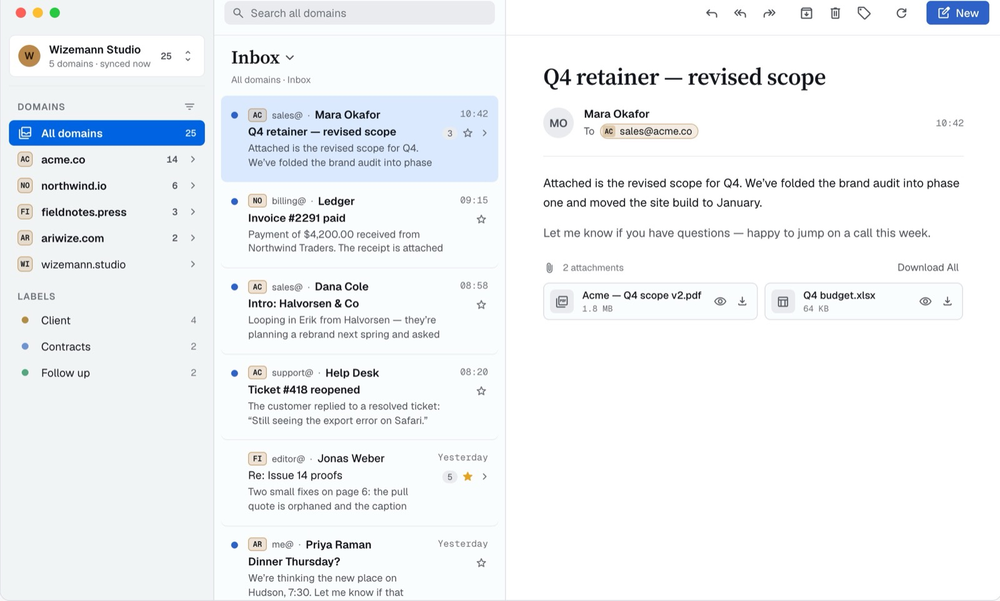

# Herald

A native macOS mail-triage client for [HQBase](https://hqbase.io) — the AGPL shared-mailbox
workspace that runs in your own Cloudflare account.

**[awizemann.github.io/herald](https://awizemann.github.io/herald/)**



> Herald is compatible with HQBase. It is an independent project, built by one of HQBase's
> users, and is **not affiliated with or endorsed by the HQBase project.** "HQBase" is a
> trademark of its respective owner. Herald talks only to HQBase's public **Mail API v1**
> (`/api/v1`) over OAuth 2.1 PKCE bearer tokens — no other mail protocol, no scraping, no
> cookies.

## What it is (and isn't)

Herald is a fast, keyboard-friendly way to triage mail across the domains and shared mailboxes
of a self-hosted HQBase instance. It's built for a single developer-owner who also uses it daily,
so it favors the workflows that owner actually has over general-purpose email-client features.
It is not a replacement for Mail.app, doesn't support IMAP/POP/Exchange, and doesn't do AI
summarization, rules engines, or anything beyond what HQBase's Mail API exposes.

## Features

- **Domains, sidebar, reading pane, settings** — a redesigned three-pane layout: a sidebar that
  drills from account → domain → mailbox → folder/label, a message list, and a merged
  reading-pane header with sanitized HTML rendering (remote images blocked until you trust the
  sender).
- **Compose** with a From picker across every address you can send as, a per-domain default From
  address, recipient tokens, Cc/Bcc, signatures (list, edit, per-scope default, live preview),
  and a quoted-thread preview for replies and forwards.
- **Attachments** — drag, drop, or paste to attach; download, Quick Look, and "Download All";
  real file types are preserved so previews work even when the server sends a message untyped.
- **Triage keyboard shortcuts** — read/unread, star, archive, trash, Put Back from Trash/Archive,
  reply, reply all, forward — from the toolbar, the row context menu, or the keyboard.
- **Multiple accounts**, each its own HQBase origin and OAuth client, with per-account and
  per-domain preferences (badge colors, hidden domains/mailboxes).
- **Search** — instant local filtering plus server-side search, with match highlighting.
- **Notifications** — new-mail alerts and a Dock badge.
- **Session recovery** — Herald re-runs sign-in by itself when a session expires while your
  HQBase web session is still alive, with a banner and Cancel if it can't.
- **Paging** for long mailbox listings, so a large Inbox doesn't have to load all at once.
- **Labels** sync into the sidebar with colored chips matching the web app.
- **Local cache** (SwiftData) for instant launch and offline reads; the server is always the
  source of truth — the cache is deleted and rebuilt on trouble, never migrated or backed up.

See [CHANGELOG.md](CHANGELOG.md) for the full, dated history of what shipped in each release.

## Requirements

- macOS 15 (Sequoia) or later, Apple silicon
- An HQBase instance running **1.3.4 or later**. Herald detects newer server features by what the
  server answers, never by a version check: on 1.4.0 it adds Reply-To honoring and retry-safe
  sending, and on 1.4.2 it adds live label membership, Settings ▸ Signatures, and sign-ins that
  outlive the browser session.

## Install

Download the latest build from **[GitHub Releases](https://github.com/awizemann/herald/releases)**,
unzip, and move `Herald.app` to `/Applications`. It's notarized and signed with a Developer ID
certificate, so Gatekeeper opens it normally.

Herald checks for updates once a day using [Sparkle 2](https://sparkle-project.org) and never
installs silently — it tells you an update is ready and waits for you to approve it. You can also
check any time from the **Herald** menu → **Check for Updates…**. Every update is signed with an
EdDSA key and verified against the key baked into the app, on top of Apple notarization.

## Privacy and analytics

Herald talks to your HQBase server and nothing else, with one exception: anonymous, **opt-out**
usage analytics. When it's on, Herald reports which features are used (e.g. "archived a
message") plus the app and OS version, tagged with a random per-install identifier so active
installs can be counted. It never sends your mail, subjects, addresses, search text, mailbox
names, account details, file names, or anything you type.

Turn it off in **Settings → Privacy**.

## Build from source

```sh
brew install xcodegen
xcodegen generate
open Herald.xcodeproj
```

Or from the command line, into isolated DerivedData, and launch a dev copy directly:

```sh
./scripts/build-detached.sh
```

`project.yml` is the source of truth; `Herald.xcodeproj` is a generated artifact and is not
committed. Debug builds are a distinct app to macOS (`com.wizemann.herald.debug`, its own
sandbox container, OAuth client, and Keychain namespace) so a dev copy never collides with an
installed release copy — sign in to it separately.

On a fresh clone, Sparkle auto-updates are disabled until you mint your own signing key with
`./scripts/sparkle-keys.sh`; this only matters if you're cutting your own releases, not for
running a local build.

## License

[GNU Affero General Public License v3.0](LICENSE).
